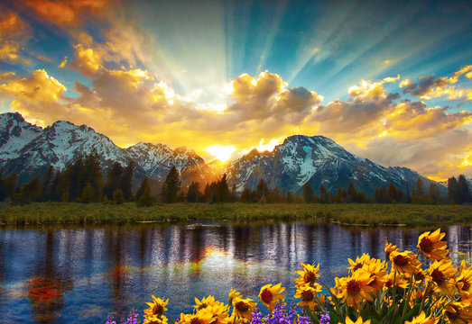
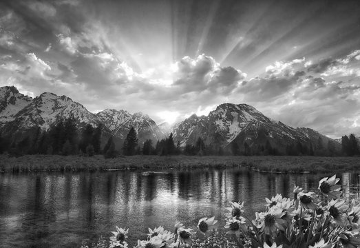

# Week 6 Homework

## *Grayscale Transformation*

### Before / After Images

**Before (Original BGR Image):** 
*Shape: `(360, 523, 3)`*

**After (Grayscale Image):** 
*Shape: `(360, 523)`*

### Short Explanation

When the original color image is loaded into our pipeline, it is represented as a NumPy 3D array consisting of Height, Width, and 3 color channels (Blue, Green, Red).

By applying a **Grayscale** function, we use a mathematical weighted sum (e.g., $Y = 0.299R + 0.587G + 0.114B$) to combine the BGR channel intensities into a single luminance value per pixel. This operation collapses the 3D array into a 2D array. This drastically reduces the data payload the AI needs to process (cutting the array size by two-thirds) while preserving the critical structural features-like edges, shapes, and contrast-that object detection models rely on.
